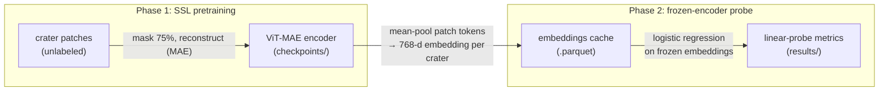

# MaCMAE: Masked Autoencoders for Mars Crater degradation classification

SSL pretraining on Mars crater imagery, probed for crater
degradation state.

This is a representation-learning probe, not a supervised classifier. A ViT
encoder is pretrained with a masked-autoencoder (MAE) objective on crater
patches without labels. Degradation labels (A/B/C) appear only afterwards,
at *probe* time, as a measurement of what the frozen representation already
separates — which sidesteps the severe class imbalance in the labels, because
pretraining never sees them.

## Pipeline

The repository contains exactly two phases:



- Encoder: `facebook/vit-mae-base` (ViT-Base, 86M params, 768-d), MAE
  pretraining *continued* on Mars crater patches (He et al., 2022).
- Probe: logistic regression on frozen mean-pooled embeddings (standard
  SSL linear eval protocol)

## Layout

```
thesis/
├── config.py                  # paths + all hyperparams
├── dataset.py                 # dataset classes + train/val/test split
├── pretrain/
│   ├── mae.py                 # HF ViT-MAE wrapper
│   └── train_mae.py           # phase 1: MAE pretraining
└── probe/
    ├── extract_embeddings.py  # encoder -> per-crater embedding cache (.parquet)
    └── linear_probe.py        # phase 2: logistic regression on frozen embeddings
```

## Data

Datasets available on Zenodo:
- [MAE pretrain dataset](https://zenodo.org/records/20808124)
- [Matched evaluation set](https://zenodo.org/records/20801959)

## Setup

Uses [uv](https://docs.astral.sh/uv/):

```bash
uv sync
```

## Running

Run everything as a module from the repo root.

Phase 1: pretrain the MAE encoder

```bash
uv run python -m thesis.pretrain.train_mae
```

Writes per-epoch checkpoints and `mae_best.pt` to `thesis/checkpoints/`. The run
is resumable (auto-resumes from `latest.pt`) and checkpoints every
`CHECKPOINT_EVERY` epochs, so the probe can be run at multiple epochs to get an
accuracy-vs-pretraining-epoch curve. Set `FRESH_START=1` to ignore an
existing `latest.pt` and start over.

Phase 2: extract embeddings and probe

```bash
# cache frozen-encoder embeddings for a checkpoint
uv run python -m thesis.probe.extract_embeddings \
    --checkpoint thesis/checkpoints/mae_best.pt
# (omit --checkpoint for the epoch-0 raw vit-mae-base baseline)

# linear probe on the cached embeddings
uv run python -m thesis.probe.linear_probe \
    --embeddings thesis/embeddings/mae_best.parquet
```

The probe writes per-class precision/recall/F1, confusion matrices, and a
`summary.json` to `thesis/results/<checkpoint>/`.

## Configuration

All paths and hyperparameters live in `thesis/config.py` and can be overridden
via environment variables (`THESIS_DATA_DIR`, `THESIS_CHECKPOINTS_DIR`,
`THESIS_EMBEDDINGS_DIR`, `THESIS_RESULTS_DIR`, `THESIS_CRATER_SUBDIR`). Key
knobs: `HF_MODEL_ID`, `BATCH_SIZE`, `LR`, `EPOCHS`, `WARMUP_EPOCHS`.

## Reference

He et al. (2022), *Masked Autoencoders Are Scalable Vision Learners*, CVPR.
